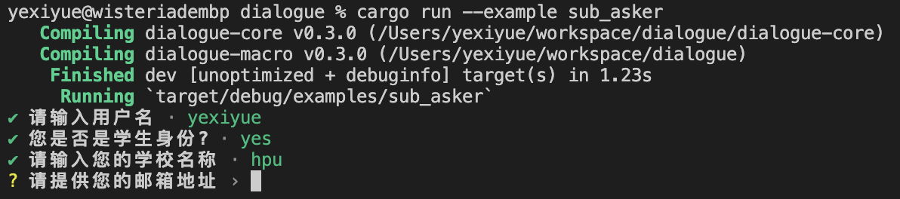

# SubAsker

`SubAsker` 是 `dialogue_macro` 库中用于标记结构体字段的属性，它允许将一个已实现 `Build` 特质的结构体或枚举类型嵌入到另一个结构体中，并作为一个子询问器进行交互式数据收集。

以下代码片段展示了如何在 `UserInput` 结构体中使用 `SubAsker` 属性：

```rust
#[derive(Debug, Asker)]
struct UserInput {
    // 其他用户输入字段...

    // 使用 SubAsker 标记字段以启用子询问器功能
    #[asker(SubAsker)]
    detailed_info: DetailedUserInfo,

    // 同样使用 SubAsker 对枚举类型进行嵌套询问
    #[asker(SubAsker)]
    choice: EnumSelection,
}
```

**重要提示：**

为了确保 `SubAsker` 正常工作，被该属性修饰的字段所对应的结构体或枚举类型必须实现 `Build` 这个特质。这样，在调用这些字段时，会自动触发其内部的 `.build()` 方法，从而逐层展开并执行相应的命令行交互逻辑。例如，在上面的示例中，`DetailedUserInfo` 和 `EnumSelection` 都需要实现 `Build` 特质。


### 示例

在本示例中，我们将展示如何通过 `dialogue_macro` 库中的 `SubAsker` 属性以及相关的 `Asker` 和 `Build` 特质来实现结构化的、层次分明的命令行用户交互流程。

首先，我们定义了一个名为 `UserInput` 的结构体，并使用 `#[derive(Asker)]` 和 `#[asker(theme = "...")]` 宏对其进行装饰，以便于在命令行界面中进行信息收集。同时，结构体中包含两个字段：`detailed_info` 和 `choice`，它们都被标记为 `#[asker(SubAsker)]`，表示这两个字段将作为一个子询问器（SubAsker）来处理更深层次的用户输入。

```rust
use dialogue_macro::{Asker, Build, EnumAsker};

#[derive(Debug, Asker)]
#[asker(theme = "dialogue_macro::ColorfulTheme")]
struct UserInput {
    username: String,
    is_student_status: bool,
    educational_institution: String,

    #[asker(SubAsker)]
    detailed_info: DetailedUserInfo,
    #[asker(SubAsker)]
    choice: EnumSelection,
}
```

接下来，我们定义了两个用于嵌套询问的类型：

1. **DetailedUserInfo** 结构体，其中包含了用户的电子邮件地址和年龄信息。这个结构体实现了 `Debug`、`Clone` 和 `Asker` 特质，并且为了配合 `SubAsker` 使用，还额外实现了 `Build` 特质。在 `impl Build for DetailedUserInfo` 中，我们定义了 `.build()` 方法以顺序获取用户邮箱地址和年龄。

```rust
#[derive(Debug, Clone, Asker)]
struct DetailedUserInfo {
    email_address: String,
    age: u8,
}

impl Build for DetailedUserInfo {
    fn build() -> Self {
        Self::asker()
            .email_address("请提供您的邮箱地址")
            .age("请输入您的年龄")
            .finish()
    }
}
```

2. **EnumSelection** 枚举，它包含了三个选项（OptionD、OptionE、OptionF）。此枚举不仅实现了 `Debug` 和 `Clone` 特质，同时也派生了 `EnumAsker` 特质，这意味着它可以作为子询问器呈现给用户选择。

```rust
#[derive(Debug, EnumAsker, Clone)]
enum EnumSelection {
    OptionD,
    OptionE,
    OptionF,
}
```

最后，在主函数中，我们实例化了 `UserInput` 并依次调用各个字段对应的询问方法：

```rust
fn main() {
    let collected_user_input = UserInput::asker()
        .username("请输入用户名")
        .is_student_status("您是否是学生身份?")
        .educational_institution("请输入您的学校名称")
        // 调用 SubAsker 来收集详细的用户信息
        .detailed_info()
        // 调用另一个 SubAsker 来让用户从枚举选项中做出选择
        .choice()
        // 收集所有用户输入并结束询问过程
        .finish();

    println!("{:?}", collected_user_input);
}
```

通过这种方式，当运行程序时，用户将会按照结构化的层级顺序依次输入相关信息，从而实现复杂而有序的命令行交互体验。




