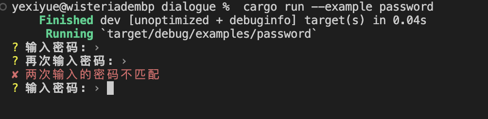

Password
=========

`Password`用于获取用户的密码输入,它会在终端中隐藏用户输入的字符。

#### 定义Password字段

要将字段定义为`Password`类型,需要使用`#[password(...)]`属性对字段进行标注,字段类型必须为`String`或`Option<String>`。与`Input`类似,如果字段为非必填项,可以声明为`Option<String>`。

`Password`不支持`default`和`with_default`参数。

#### 配置选项

- **prompt**: 指定提示用户输入密码的文本内容。
- **confirmation**: 指定提示用户再次确认密码的文本内容。
- **mismatch**: 当用户两次输入的密码不匹配时显示的错误信息。
- **validate_with**: 指定验证函数，验证用户输入的值是否符合要求。

#### 示例

```rust
#![allow(unused)]
use dialogue_macro::Asker;

#[derive(Asker, Debug)]
struct User {
    // 普通密码输入字段，用户可选择是否输入密码
    #[password(
        validate_with = |input| {
            if input.len() < 6 {
                return Err("密码长度不能小于6");
            }
            Ok(())
        }
    )]
    password: Option<String>,

    // 带确认和错误提示的密码输入字段
    #[password(
        prompt = "输入密码(测试2):",
        confirmation = "再次输入密码(测试2):",
        mismatch = "两次输入的密码不匹配"
    )]
    password2: String,
}

fn main() {
    let user = User::asker().password("输入密码:").password2().finish();

    println!("{:?}", user);
}

```




在这个例子中：

- `password2` 字段要求用户提供一个密码，并需要再次确认输入以确保正确无误。如果两次输入的密码不匹配，则会显示预设的错误信息“两次输入的密码不匹配”。

在 `main` 函数中：

- 我们首先初始化了 `User` 结构体的询问器实例，并按照逻辑顺序依次收集用户的密码输入信息。
- 当运行程序时，会根据定义的提示信息提示用户输入密码，并检查密码确认过程中的匹配性。
- 收集完成后，`.finish()` 方法返回一个包含了用户输入密码信息的 `User` 结构体实例，并将其输出至控制台。
