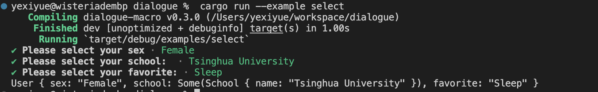

Select
=========

`Select` 用于从给定选项列表中让用户选择一项。

#### 定义 Select 字段

要将字段定义为 `Select` 类型,需要使用 `#[select(...)]` 属性对字段进行标注。字段类型必须为 `String` 或实现了 `ToString` trait 的类型(`T`)或 `Option<T>`。

如果没有提供 `options` 配置选项,则需要在调用相应方法时传递选项列表。

**注意：`T`类型也必须实现`Clone`trait**


#### 配置选项

- **prompt**: 指定提示用户进行选择的文本内容。
- **options**: 包含选项列表的数组或向量,每个选项必须实现 `ToString` trait。
- **default**: 设置默认选中项的索引(从 0 开始)。
- **with_default**: 布尔值参数,当设为 `true` 时,在调用相应方法时需要传递默认值的索引。


#### 示例

```rust
#![allow(unused)]
use dialogue_macro::Asker;

#[derive(Asker, Debug)]
struct User {
    
    #[select(prompt = "Please select your sex", options = ["Male", "Female", "Other"], default = 1)]
    sex: String,

    #[select(
        prompt = "Please select your school: ",
        default = 1,
        options = [
            School { name: "Tsinghua University".to_string() },
            School { name: "Peking University".to_string() },
            School { name: "Henan Polytechnic University".to_string() }
        ],
        with_default = true
    )]
    school: Option<School>,


    #[select()]
    favorite: String,
}

// 定义表示学校的结构体，实现Debug和Clone特质
#[derive(Debug, Clone)]
struct School {
    name: String,
}

// 实现ToString trait，将School结构体转换为字符串形式
impl ToString for School {
    fn to_string(&self) -> String {
        self.name.clone()
    }
}

fn main() {

    let options = vec!["Eat".to_string(), "Sleep".to_string(), "Coding".to_string()];

    let user = User::asker()
        .sex()
        .school(2)
        .favorite("Please select your favorite:", &options)
        .finish();

    println!("{:?}", user);
}

```



在此示例中：

- `sex` 字段是一个多选类型，提供了预设的性别选项，默认选择“Female”。
- `school` 字段也是一个多选类型，使用了自定义的 `School` 结构体来描述学校选项，并指定了默认值的索引为2（对应于“Henan Polytechnic University”）。
- `favorite` 字段同样为多选类型，但在调用 `.favorite()` 方法时需要传入选项列表和提示信息。

在 `main` 函数中：

- 我们首先定义了一个表示用户最喜欢的活动选项列表。
- 然后初始化了 `User` 结构体的询问器实例，并分别为 `sex`、`school` 和 `favorite` 字段指定了默认值或选项列表。
- 当运行程序时，会按照顺序展示预设的提示信息，并根据提供的默认值和选项进行交互式信息收集。
- 收集完成后，`.finish()` 方法返回一个包含了用户回答信息的 `User` 结构体实例，并将其输出至控制台。
