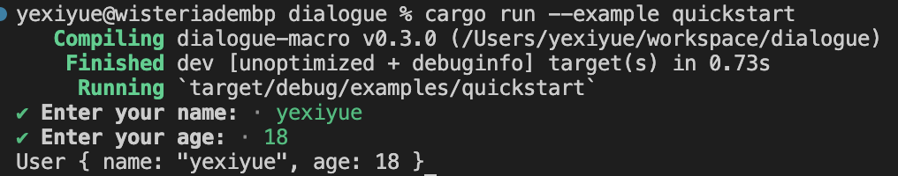

# 快速开始

首先通过cargo添加`dialogue-macro`依赖:

```bash
cargo add dialogue-macro
```

然后在您的Rust代码中导入该crate:

```rust
use dialogue_macro::Asker;
```

接下来,使用`#[derive(Asker, Debug)]`宏来为需要交互式输入的结构体派生相关trait:

```rust
#[derive(Asker, Debug)]
struct User {
    #[input(prompt = "请输入您的名字:")]
    name: String,
    age: u32,
}
```

`#[derive(Asker)]`会自动为结构体实现`asker()`构造器方法。对于带有`#[input(prompt = "...")]`属性的字段,您可以直接调用同名方法(无需再传入提示文本作为参数)。

最后,使用派生的方法链式调用来获取用户输入:

```rust
fn main() {
    let user = User::asker()
        .name()
        .age("请输入您的年龄:")
        .finish();

    println!("{:?}", user);
}
```

运行该程序,您将看到类似以下的交互式提示:



